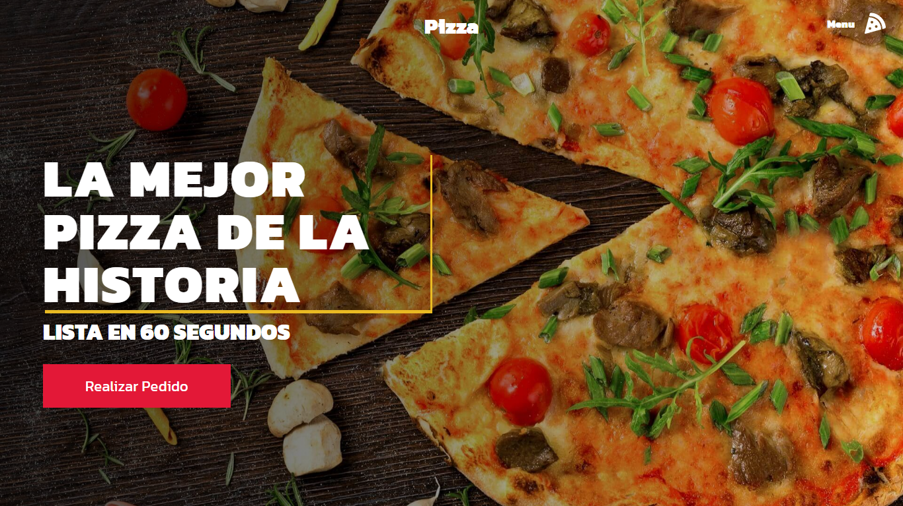

# Pizza Web 🍕

Página web de una pizzería

## Live Preview 👁‍🗨

<a href="https://pizza-web.vercel.app/" target="_blank" rel="noopener noreferrer">https://pizza-web.vercel.app/</a>



## Tecnologías usadas 💻

- [Next.js](https://nextjs.org/)
- [Sass](https://sass-lang.com/)
- [React](https://es.reactjs.org/)
- [React-Icons](https://react-icons.github.io/react-icons/)

## Comandos para ejecutar el proyecto :

```bash
yarn

yarn dev
```
